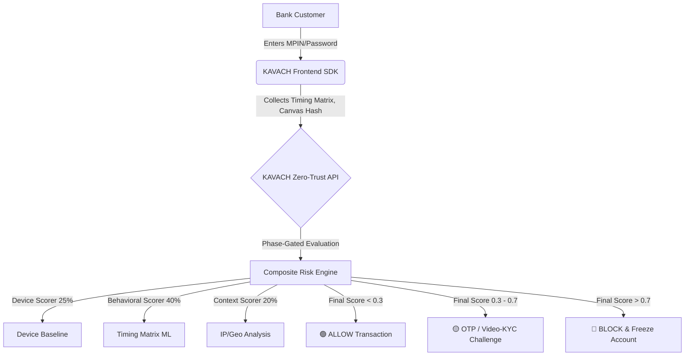

<div align="center">
  <h1>🛡️ KAVACH</h1>
  <p><strong>AI-Driven Behavioral Authentication Engine for Digital Banking</strong></p>
  
  [](https://www.python.org/)
  [](https://fastapi.tiangolo.com/)
  [](https://opensource.org/licenses/MIT)
  []()
</div>

<br>

> **Developed by:** Deepak Kumar Ravi, Gaurav Raj, and Umesh Gupta  
> **Organization:** PSB Hackathon (Central Bank of India) @ MNNIT Allahabad  

---

## 📖 The Problem: "Jamtara" and Social Engineering
The Indian digital banking ecosystem (UPI, Net Banking, Mobile Banking) is highly advanced but overwhelmingly relies on **Static Authentication** (Passwords, MPINs, SMS OTPs). 

Cybercriminals exploit this via social engineering—tricking rural or unaware users into installing screen-sharing malware (like AnyDesk) or phishing their OTPs. Once the attacker has the credential, traditional banking systems cannot distinguish between the legitimate user and the attacker. The result? Massive financial fraud.

## 🚀 The Solution: KAVACH (Continuous Behavioral Authentication)
**KAVACH** shifts the security paradigm from *"What you know"* (Passwords) to *"Who you are and how you act"* (Behavioral DNA). 

By silently analyzing Keystroke Dynamics, Device Haptics, Mouse Entropy, and Device Fingerprinting, KAVACH acts as an invisible security guard. Even if a scammer steals an OTP, their typing rhythm and hardware signature will not match the user's baseline, resulting in an immediate transaction block.

---

## 🎯 Project Goals
| Goal | Description |
| :--- | :--- |
| **Zero-Trust Validation** | Never trust a login just because the password is correct. Always verify the Behavioral DNA. |
| **Frictionless Security** | Provide military-grade security without adding a 5-second loading screen to a ₹50 UPI payment. |
| **DPDP Compliance** | Utilize a "Zero-Knowledge" architecture. We do not record what is typed, only the *timing matrix* between keystrokes. |
| **Remote-Access Defense** | Fuse digital inputs with physical sensors (Gyroscopes) to detect when a phone is being remotely operated. |

---

## 🧠 Core Concepts & Innovation

### 1. Hierarchical Risk Scaling (The UPI Paradigm)
India processes 14+ Billion UPI transactions monthly. A heavy ML model cannot be run on every ₹10 payment. KAVACH dynamically scales its defense:
*   **Low-Value UPI (< ₹2,000):** Relies on instant Device Fingerprinting and Canvas Hashing (0.01s latency).
*   **High-Value / Net Banking:** Activates the full Behavioral ML Matrix (Keystrokes + Sensor Fusion) requiring slightly slower, deliberate input.

### 2. Phase-Gated Enrollment (Solving the Cold Start)
ML systems often suffer from "False Positives" on Day 1 because they lack baseline data. KAVACH utilizes a Phase-Gated system:
*   **Logins 1 to 5 (Enrollment Phase):** The Behavioral ML is *muted*. The system quietly observes and builds a highly confident Timing Matrix baseline.
*   **Login 6+ (Production Phase):** The Zero-Trust Engine fully activates.

### 3. Sensor Fusion (Mouse Entropy & Haptics)
*   **Net Banking:** KAVACH monitors "Mouse Entropy". Attackers using remote-desktop software (AnyDesk) produce mathematical "micro-stutters" due to network latency. KAVACH detects this anomaly instantly.
*   **Mobile Banking:** Fuses typing speed with physical Gyroscope data. If typing occurs while the phone is completely flat and stationary on a desk, it flags potential remote-control tampering.

---

## 🏗️ System Architecture

The KAVACH architecture operates as a **Headless SDK & Risk API** designed to sit invisibly inside the Central Bank of India's existing applications.



---

## 💻 Tech Stack
| Component | Technology |
| :--- | :--- |
| **Backend API** | FastAPI (Python 3.11), Uvicorn |
| **Database** | SQLite (SQLAlchemy ORM) |
| **Security/Crypto** | bcrypt, python-jose (JWT), DPDP-compliant one-way hashing |
| **Frontend UI** | HTML5, CSS3 (Glassmorphism), Vanilla JavaScript |
| **Risk Engine** | Custom Python mathematical baseline arrays (Z-Score normalization) |

---

## 🛠️ How to Run the Demo

**1. Clone the Repository:**
```bash
git clone <repository-url>
cd Kavach
```

**2. Start the Interactive CLI Wizard:**
We built a custom CLI wrapper specifically for the PSB Hackathon demonstration.
```bash
python start_kavach.py
```
*   The script will prompt you to automatically install all dependencies (`pip install`).
*   It will boot the Uvicorn server and dynamically log all ML Risk Engine evaluations directly to the terminal.

**3. Test the Application:**
*   Visit `http://localhost:8000` in your browser.
*   Click **Enroll New User** to begin the Phase 1 Baseline gathering.

---

<div align="center">
  <i>"Securing India's digital future, one keystroke at a time."</i>
</div>