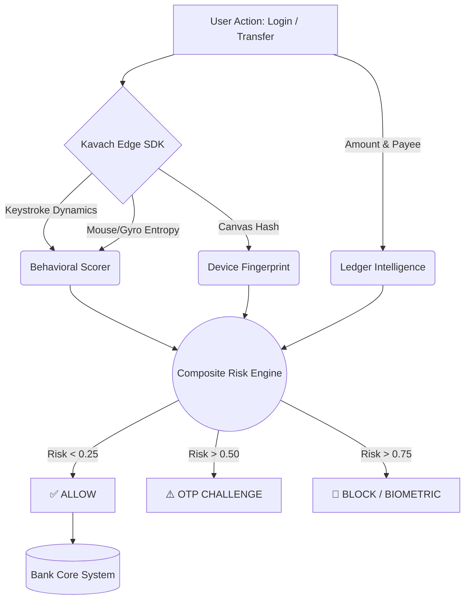

<h1 align="center">🛡️ KAVACH</h1>
<h3 align="center">AI-Driven Behavioral Authentication Engine for Digital Banking</h3>
<p align="center">
  <em>Protecting Indian Banking from Jamtara-style Social Engineering and Remote Access Frauds using Zero-Trust Behavioral ML.</em>
</p>

---

## 🛑 The Problem Statement
In recent years, digital banking fraud in India (especially UPI and IMPS) has skyrocketed. Fraudsters using social engineering techniques, fake customer support calls, and screen-sharing apps (like AnyDesk or TeamViewer) easily bypass traditional security measures (Passwords, MPINs, and SMS OTPs). 

Once the fraudster has the victim's credentials or screen access, traditional banking apps assume the session is legitimate. **We need a system that authenticates the *human*, not just the password.**

## 🎯 Our Goal
1. Differentiate between legitimate users and suspicious attackers even *after* a successful login.
2. Implement AI-enabled behavior-based authentication.
3. Prevent account takeover (ATO) and digital frauds without adding friction to legitimate users.
4. Harden the login process dynamically based on behavioral risk scoring.

## 💡 Our Proposed Solution: KAVACH
**KAVACH** is a continuous, invisible authentication layer that runs entirely in the background. It analyzes the **Behavioral DNA** of the user—their typing rhythm, hesitation, device handling, and financial ledger patterns. 

By employing **Sensor Fusion** and a custom **Kavach Ledger Intelligence (KLI)** engine, Kavach detects the subtle differences between the actual account holder and a fraudster (or a Remote Desktop bot). 

If an anomaly is detected, Kavach triggers an instant `OTP_CHALLENGE` or `BIOMETRIC_STEP_UP` before the funds leave the bank.

---

## 🏗️ Architecture & Working Diagram

Kavach employs a Zero-Trust architecture evaluating 5 layers of signals on every interaction:



### The 3 Core Pillars of KAVACH:
1. **Behavioral Biometrics:** Tracks Hold Time (how long keys are pressed) and Inter-Key Interval (rhythm between keys). Attackers typing a stolen password type fundamentally differently than the real user.
2. **Device & Haptic Sensors:** Calculates Mouse Entropy to detect the micro-stutters indicative of AnyDesk/TeamViewer remote desktop lag. Also reads Gyroscope data to detect if a mobile device is lying perfectly flat (bot behavior).
3. **Ledger Intelligence (KLI):** The "Deepak vs Albert" model. Kavach dynamically understands if a ₹25,000 transaction is completely normal for a high-spender (Albert) or a 60x anomaly for a frugal user (Deepak), and checks the payee's historical trust network.

---

## 🛠️ Technical Stack
- **Backend:** Python, FastAPI, SQLAlchemy, SQLite (for demo)
- **Frontend:** Vanilla HTML/CSS, JavaScript (Zero dependencies for max speed)
- **Machine Learning:** Statistical Z-Score Anomaly Detection, Welford's Online Algorithm for Variance
- **Security:** JWT Auth, Canvas Fingerprinting, Bcrypt Password Hashing

---

## 🚀 Current Status & Features
- [x] **Behavioral SDK:** Captures typing patterns and mouse entropy in real-time.
- [x] **Risk Engine:** Fuses Behavioral, Device, and Ledger data into a 0.0 - 1.0 composite risk score.
- [x] **Interactive Dashboard:** Users can see their real-time session security score.
- [x] **Automated Defense:** Blocks high-value transactions to unknown recipients when typing patterns don't match.
- [x] **Live Matrix Terminal:** Backend logs beautifully display the exact ML reasoning for every allowed/blocked action.

---

## 🔮 Future Scope & Banking Integration
Kavach is designed to be easily integrated into existing banking apps:
- **Federated Learning:** Instead of sending raw keystrokes to the server, we will deploy lightweight TensorFlow.js models on the edge (browser/mobile). The server only receives encrypted weight updates, maximizing DPDP compliance.
- **Siamese Neural Networks:** Replace Z-Score with Few-Shot Learning models to authenticate users with even fewer baseline sessions.
- **FIDO2 / WebAuthn:** Integrate hardware-backed passkeys for frictionless step-up authentication.

---

## 📁 Folder Architecture

```text
Kavach/
├── backend/
│   ├── main.py                   # FastAPI Application & Routes
│   ├── models.py                 # Database Schema (Users, Txns, Profiles)
│   ├── schemas.py                # Pydantic validation schemas
│   ├── risk_engine/              
│   │   ├── behavioral_scorer.py  # Keystroke & Sensor ML logic
│   │   ├── transaction_scorer.py # Financial anomaly logic (KLI)
│   │   └── composite_scorer.py   # Sensor Fusion aggregator
│   └── enrollment/
│       └── enrollment_manager.py # Graduating new users to active models
├── frontend/                     # Vanilla HTML/JS Dashboard & UI
│   ├── index.html
│   ├── dashboard.html
│   ├── send-money.html
│   └── js/
│       ├── kavach-sdk.js         # The Edge Data Collector
│       └── utils.js
├── docs/                         # Detailed architecture and pitch notes
├── start_kavach.py               # Main CLI Entry Point & Demo Runner
├── seed_demo_data.py             # Generates the 4-friends financial histories
└── advanced_test_kavach.py       # Automated QA Attack Scripts
```

---

## 💻 How to Start the Project

1. **Install Dependencies:**
   Ensure you have Python 3.9+ installed. Run:
   ```bash
   pip install fastapi uvicorn sqlalchemy pydantic passlib bcrypt python-jose colorama requests
   ```

2. **Launch the Kavach Engine:**
   Run the master script to open the interactive menu:
   ```bash
   python start_kavach.py
   ```

3. **Demo Walkthrough:**
   - **Step 1:** Select `Option 3` first to seed the database with synthetic financial histories (The "4 Friends" Demo).
   - **Step 2:** Select `Option 2` to run the automated Hacker vs Good User attack simulations in your terminal.
   - **Step 3:** Select `Option 1` to boot the Live Web Server. Open `http://localhost:8000` in your browser. Try logging in as `deepak@kavach` (password: `deepak123`) and watch the interactive ML terminal analyze your keystrokes!