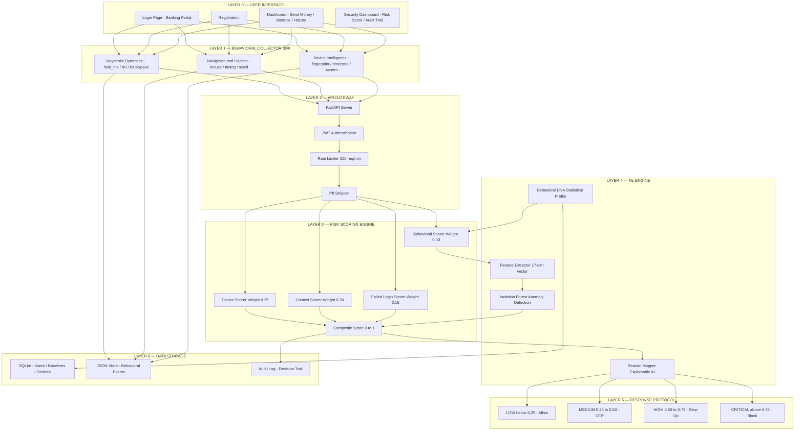
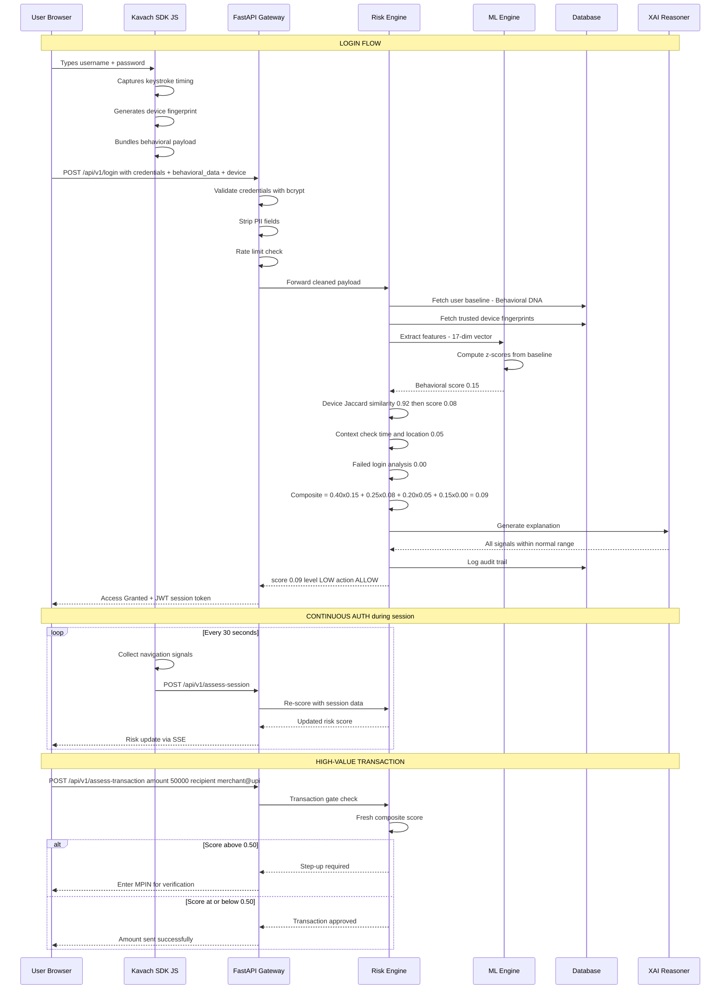
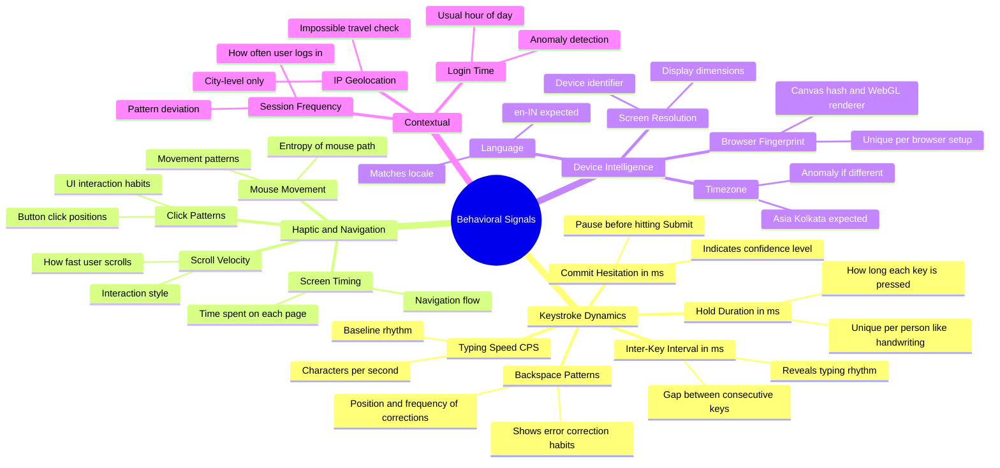
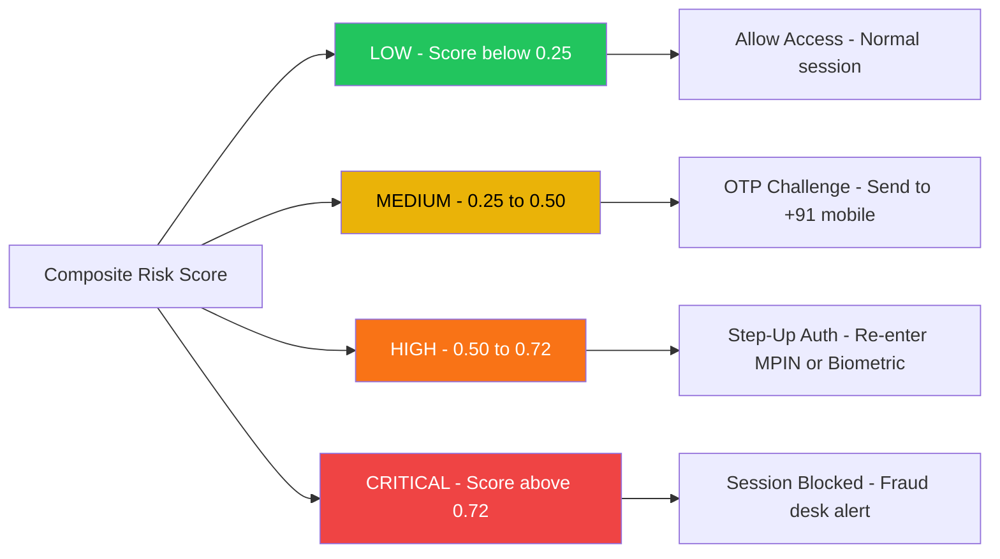
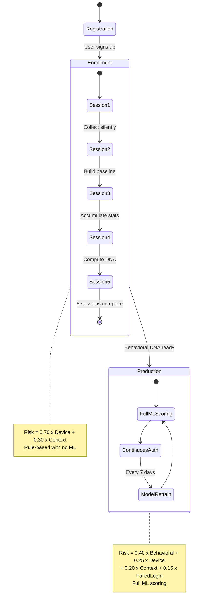

# KAVACH — Project Architecture, Concept & Working

> **KAVACH** (कवच — Shield) is an AI-driven behavioral authentication system for Indian digital banking that creates a unique "Behavioral DNA" fingerprint for every user, enabling continuous, invisible, and privacy-preserving fraud detection.

---

## 1. Executive Summary

### The Problem India Faces

India's digital banking ecosystem is the fastest-growing in the world:
- **14.04 billion** UPI transactions in March 2024 alone (NPCI)
- **₹20.64 lakh crore** transacted via UPI in a single month
- **350+ million** active UPI users across India
- **708% surge** in digital banking fraud (2017-2023, RBI Annual Report)
- **₹1,457 crore** lost to cyber fraud in 2023 (National Crime Records Bureau)

Yet the authentication layer protecting all of this remains stuck in the 1990s:

```
Current State:                          KAVACH State:
━━━━━━━━━━━━━━━━━━                      ━━━━━━━━━━━━━━━━━━━━━━
                                        
Password: "Rahul@123"                   Password: "Rahul@123"
    ↓                                       ↓
✅ Access Granted                       + How Rahul TYPES it
(Anyone with password gets in)          + What device Rahul uses
                                        + When Rahul typically logs in
                                        + How Rahul navigates the app
                                            ↓
                                        🧬 Behavioral DNA Match?
                                            ↓
                                        ✅ Real Rahul → Access Granted
                                        🚫 Not Rahul → Step-Up / Block
```

### The Core Insight

> **"It's not just WHAT you know (password), it's HOW you type it."**

Every person has a unique typing rhythm — like a fingerprint, but behavioral. KAVACH captures this rhythm invisibly, builds a statistical profile (Behavioral DNA), and uses it to verify identity continuously.

---

## 2. Core Concept: Behavioral DNA

### What is Behavioral DNA?

Behavioral DNA is a statistical fingerprint computed from how a user interacts with the banking application. It cannot be stolen, phished, or shared — because it IS the user.

```
Raw Behavioral Signals                Statistical Profile (DNA)
━━━━━━━━━━━━━━━━━━━━━━               ━━━━━━━━━━━━━━━━━━━━━━━━
                                      
Keystroke: [82ms, 95ms, 71ms, ...]    hold_mean:  84.2ms
           (how long each key held)   hold_std:   11.7ms
                                      hold_skew:  -0.23
                                      
Inter-Key: [120ms, 145ms, 98ms, ...]  iki_mean:   118.5ms
           (gap between keys)         iki_std:    22.1ms
                                      
Backspaces: [pos: 4, pos: 12]        backspace_ratio: 0.08
                                      
Mouse: [entropy: 3.7]                mouse_entropy:   3.7
                                      
Speed: 5.2 chars/sec                  typing_cps:      5.2
```

### Why It Can't Be Faked

| Attack Vector | Password | OTP | Behavioral DNA |
|--------------|----------|-----|---------------|
| Phishing | ❌ Stolen easily | ❌ SIM swap / intercept | ✅ Can't be typed by someone else |
| Credential Stuffing | ❌ Reused passwords | ❌ Automated bypass | ✅ Bot typing ≠ human typing |
| Shoulder Surfing | ❌ Visible | ❌ Visible | ✅ Invisible to observer |
| Malware/Keylogger | ❌ Captures keys | ⚠️ Captures OTP | ✅ Records keys, not timing patterns |
| Social Engineering | ❌ "Share your password" | ❌ "Share your OTP" | ✅ Can't share your typing rhythm |

---

## 3. System Architecture

### Layered Architecture Overview



### Data Flow Architecture



---

## 4. Behavioral Signal Taxonomy

### What We Capture (and Why)



### Feature Vector (17 Dimensions)

| # | Feature | Source | Type | Range |
|---|---------|--------|------|-------|
| 1 | `hold_mean` | Keystroke | Continuous | 50-300 ms |
| 2 | `hold_std` | Keystroke | Continuous | 5-80 ms |
| 3 | `hold_skew` | Keystroke | Continuous | -2 to +2 |
| 4 | `iki_mean` | Keystroke | Continuous | 80-500 ms |
| 5 | `iki_std` | Keystroke | Continuous | 10-150 ms |
| 6 | `typing_speed_cps` | Keystroke | Continuous | 1-12 CPS |
| 7 | `backspace_count` | Keystroke | Discrete | 0-20 |
| 8 | `backspace_position_avg` | Keystroke | Continuous | 0-1 (normalized) |
| 9 | `commit_hesitation_ms` | Keystroke | Continuous | 100-5000 ms |
| 10 | `mouse_entropy` | Haptic | Continuous | 0-10 |
| 11 | `session_duration_s` | Haptic | Continuous | 5-300 s |
| 12 | `device_trust_score` | Device | Continuous | 0-1 |
| 13 | `timezone_match` | Device | Binary | 0 or 1 |
| 14 | `screen_match` | Device | Binary | 0 or 1 |
| 15 | `login_hour_deviation` | Context | Continuous | 0-12 hours |
| 16 | `geo_zone_match` | Context | Binary | 0 or 1 |
| 17 | `failed_attempt_score` | Context | Continuous | 0-1 |

---

## 5. Risk Scoring Engine — Detailed Breakdown

### Composite Risk Formula

```
┌─────────────────────────────────────────────────────────────────┐
│                    COMPOSITE RISK SCORE                         │
│                                                                 │
│   Risk = 0.40 x B + 0.25 x D + 0.20 x C + 0.15 x F           │
│                                                                 │
│   Where:                                                        │
│     B = Behavioral Score  (keystroke + haptic anomaly)          │
│     D = Device Score      (fingerprint mismatch)               │
│     C = Context Score     (time + location anomaly)            │
│     F = Failed Login Score (suspicious failure pattern)         │
│                                                                 │
│   All sub-scores in range [0, 1]                               │
│   Composite in range [0, 1]                                    │
│                                                                 │
│   Higher score = Higher risk = More suspicious                  │
└─────────────────────────────────────────────────────────────────┘
```

### Sub-Score Computation

#### Behavioral Score (Weight: 0.40)

```python
# Phase 1 (Rule-Based) — Works from Session 1
def compute_behavioral_score(current_features, baseline_dna):
    """
    Z-score deviation from Behavioral DNA baseline.
    
    Example:
    - Ramesh's baseline: hold_mean=84ms, hold_std=12ms
    - Current login: hold_mean=140ms  
    - Z-score = |140 - 84| / 12 = 4.67 (very unusual!)
    - Normalized score = sigmoid(4.67) = 0.85 (HIGH)
    """
    z_scores = []
    for feature in KEY_FEATURES:
        z = abs(current[feature] - baseline[feature + '_mean']) / baseline[feature + '_std']
        z_scores.append(z)
    
    avg_z = mean(z_scores)
    return sigmoid(avg_z - 2.0)  # Centered so z=2 maps to 0.5
```

#### Device Score (Weight: 0.25)

```python
# Jaccard Similarity between device fingerprints
def compute_device_score(current_fp, stored_fps):
    """
    Example:
    - Ramesh's trusted device: {canvas: "a7f3", webgl: "Intel", screen: "1920x1080"}
    - Current device: {canvas: "a7f3", webgl: "Intel", screen: "1920x1080"}
    - Jaccard = 3/3 = 1.0 -> score = 1 - 1.0 = 0.0 (trusted!)
    
    - Unknown device: {canvas: "b2c4", webgl: "NVIDIA", screen: "2560x1440"}
    - Jaccard = 0/6 = 0.0 -> score = 1 - 0.0 = 1.0 (new device!)
    """
    best_match = max(jaccard(current_fp, fp) for fp in stored_fps)
    return 1.0 - best_match
```

#### Context Score (Weight: 0.20)

```python
# Time anomaly + Impossible travel
def compute_context_score(login_event, user_history):
    """
    Example 1 — Time anomaly:
    - Ramesh usually logs in 9am-6pm IST
    - Current login: 3:17am IST
    - Time deviation = 6+ hours -> score contribution: 0.7
    
    Example 2 — Impossible travel:
    - Last login: Mumbai, 2:00pm
    - Current login: Bangalore, 2:30pm (30 min later)
    - Distance: 980 km, Speed needed: 1960 km/h (impossible!)
    - -> score contribution: 1.0
    """
    time_score = compute_time_anomaly(login_event.hour, user_history.usual_hours)
    travel_score = compute_impossible_travel(login_event.geo, user_history.last_geo)
    return max(time_score, travel_score)
```

### Response Protocol



---

## 6. Enrollment vs Production — Two Modes

### The Cold Start Problem

When a new user registers, KAVACH has zero behavioral data. It can't immediately build a DNA profile. This is the **cold start problem**, solved by a 5-session enrollment phase.



### Comparison Table

| Aspect | Enrollment (Sessions 1-5) | Production (Session 6+) |
|--------|--------------------------|------------------------|
| **Risk Formula** | 0.70 x Device + 0.30 x Context | 0.40 x B + 0.25 x D + 0.20 x C + 0.15 x F |
| **Behavioral Scoring** | Disabled (no baseline) | Z-score from Behavioral DNA |
| **ML Model** | Not trained yet | Isolation Forest active |
| **Data Collection** | Silent, aggressive | Continuous, normal |
| **Default Risk Posture** | Conservative (stricter thresholds) | Normal |
| **User Experience** | Slightly more OTPs | Seamless if behavior matches |

---

## 7. Continuous Authentication

Unlike traditional login-once systems, KAVACH monitors behavior throughout the entire session:

```
Login (t=0)           Navigation (t=30s)         Transaction (t=120s)
Score: 0.09 ALLOW     Score: 0.12 ALLOW          Score: 0.45 OTP
"All normal"          "Normal browsing"           "Unusual click pattern"
                                                   -> Step-up: Enter MPIN

Why this matters:

Scenario: Ramesh logs in legitimately (score: 0.09), then walks away
from laptop. His colleague Suresh sits down and tries to transfer 
money. KAVACH detects:
  - Mouse movement pattern changed
  - Navigation speed increased  
  - Clicking pattern doesn't match Ramesh
  -> Score spikes to 0.65 -> Step-up auth required
  -> Suresh can't complete the transfer
```

---

## 8. Privacy-by-Design Architecture

### What We Store vs What We Don't

| Category | Examples | Stored? |
|----------|----------|---------|
| **Non-PII (Safe to Store)** | hold_durations, typing_speed, device_fp_hash, timezone, screen, ip_city_hash | ✅ Yes |
| **PII (Never Stored in ML)** | Raw keystrokes, passwords, GPS coordinates, raw IP, Aadhaar, PAN, account numbers, full name | ❌ Never |

### Behavioral DNA = One-Way Transformation

```
Raw Data:                      Behavioral DNA:
"p-a-s-s-w-o-r-d"            hold_mean: 84.2ms
[82ms, 95ms, 71ms, ...]       hold_std: 11.7ms
                               hold_skew: -0.23
    Statistical Moments        
    (mean, std, skew)          Cannot reverse-engineer
                               Cannot reconstruct password
    ONE-WAY FUNCTION           Cannot extract raw keystrokes
```

This is **privacy-by-design** — the statistical moments (mean, standard deviation, skewness) cannot be reversed to recover the original keystroke data. This makes KAVACH compliant with:
- RBI Data Localization norms
- IT Act 2000 (Section 43A — sensitive personal data)
- Digital Personal Data Protection Act 2023 (data minimization principle)

---

## 9. Indian Regulatory Compliance

| Regulation | KAVACH Compliance |
|------------|------------------|
| **RBI Master Direction on Digital Payment Security Controls (2021)** | Multi-factor behavioral auth, continuous monitoring, device binding |
| **RBI Circular on Fraud Monitoring (2024)** | Real-time fraud scoring, automated alerts, audit trail |
| **NPCI UPI Security Guidelines** | Device fingerprinting, MPIN behavioral capture, transaction-level risk |
| **IT Act 2000, Section 43A** | No PII stored in ML pipeline, statistical aggregates only |
| **DPDP Act 2023** | Data minimization, purpose limitation, no raw biometric storage |
| **CERT-In Reporting Requirements** | Audit trail with timestamps, XAI reasons for every decision |

---

## 10. Technology Stack — Why Each Choice

| Component | Choice | Why (for this project) |
|-----------|--------|----------------------|
| **Python 3.11** | Backend language | Fastest for ML + API development, rich ecosystem |
| **FastAPI** | API framework | Async by default, auto-docs at /docs, type validation |
| **SQLite** | Database | Zero install, single file, easy demo setup |
| **Vanilla JS** | Frontend | No build step, direct DOM access for keystroke capture |
| **NumPy + SciPy** | Statistical ML | Z-score computation, statistical moments, lightweight |
| **scikit-learn** | Anomaly detection | Isolation Forest in 5 lines, battle-tested |
| **JWT (PyJWT)** | Session auth | Stateless, standard, lightweight |
| **bcrypt (passlib)** | Password hashing | Industry standard, slow-by-design |

---

## 11. Security Considerations

### Threat Model

| Threat | KAVACH Defense |
|--------|---------------|
| **Credential theft** | Behavioral DNA doesn't match attacker's typing |
| **Session hijacking** | Continuous auth detects behavior change mid-session |
| **Bot/Automated attacks** | Zero mouse entropy, inhuman typing speed detected |
| **Replay attacks** | Timestamp + device fingerprint + behavioral freshness check |
| **Man-in-the-middle** | HTTPS + JWT integrity + behavioral payload signed |
| **Model evasion** | Multi-signal fusion — attacker must fake ALL signals simultaneously |
| **Adversarial ML** | Isolation Forest is robust to small perturbations |

### What KAVACH Does NOT Replace
- KAVACH **adds a layer** on top of passwords/OTP — it doesn't replace them
- KAVACH is **not** a standalone authentication system
- KAVACH works **best in combination** with existing security infrastructure

---

## 12. Performance Targets

| Metric | Target | Meaning |
|--------|--------|---------|
| **FAR** (False Acceptance Rate) | < 2% | Attacker gets through less than 2% of the time |
| **FRR** (False Rejection Rate) | < 5% | Real user blocked less than 5% of the time |
| **EER** (Equal Error Rate) | < 3.5% | Overall system accuracy |
| **Scoring Latency** | < 200ms | Risk score computed in real-time |
| **SDK Overhead** | < 5% CPU | Behavioral capture doesn't slow the app |

---

## 13. Scalability Path (Demo to Production)

```
Demo (Hackathon)              Production (Bank Deployment)
SQLite                   ->   PostgreSQL (clustered)
In-memory dict           ->   Redis (distributed cache)
JSON file store          ->   MongoDB (sharded)
JSON audit log           ->   Elasticsearch + Kibana
Single process           ->   Kubernetes pods (auto-scale)
Rule-based scoring       ->   Isolation Forest + LSTM
Local model files        ->   MLflow model registry
Manual deployment        ->   CI/CD pipeline
```

Every component in the demo is designed with a **clean interface** that can be swapped to a production backend without changing the business logic.
