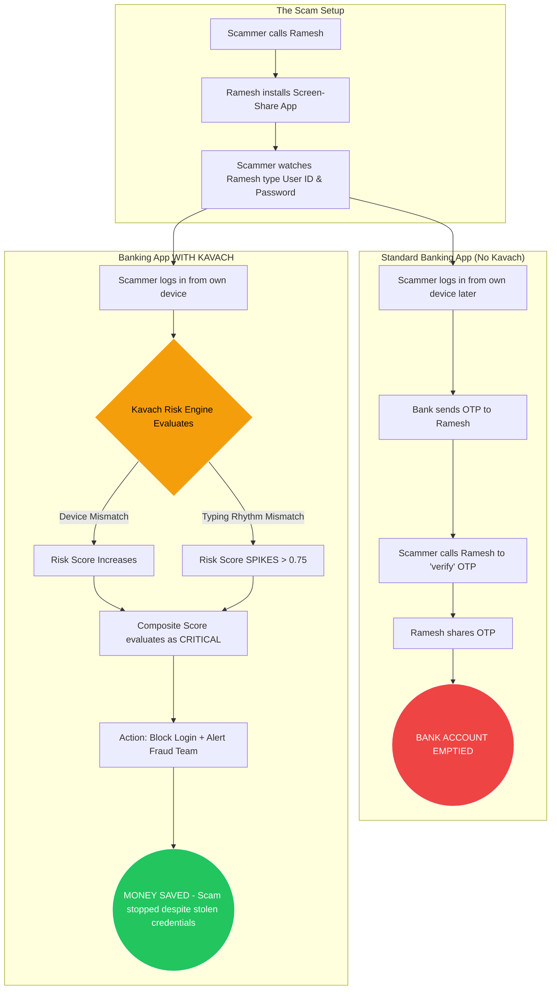
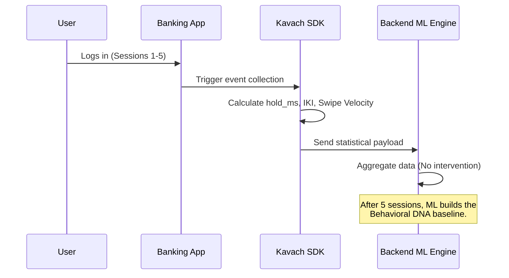
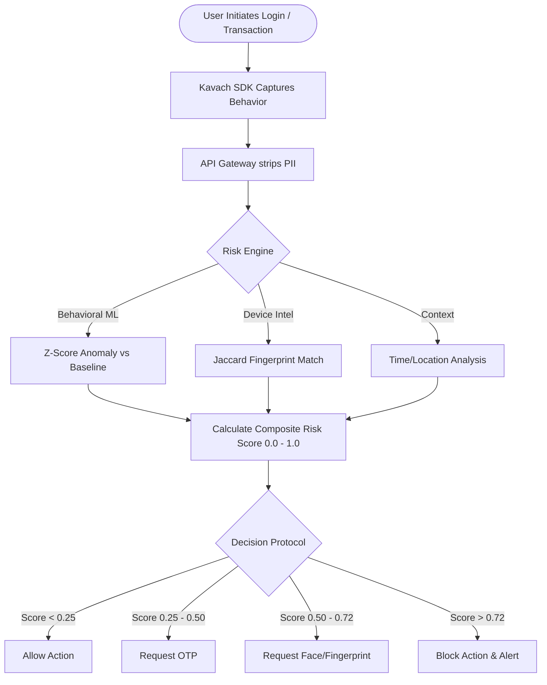

# KAVACH — Proposed Solution & Indian Scenario Working

> This document details the proposed solution for the PSB Hackathon (Phase 2), with a specific focus on how KAVACH solves uniquely Indian digital banking challenges.

---

## 1. The Indian Context & Unique Challenges

India's rapid digitization of payments (UPI, IMPS, NEFT) has brought financial inclusion to millions, but it has also created a massive attack surface for fraudsters. Traditional security models fail in the Indian context for several reasons:

### Challenge 1: The "Jamtara" Model (Social Engineering)
In India, the most prevalent frauds are not high-tech hacking, but social engineering (phishing, vishing, screen-sharing apps). Fraudsters convince victims to share their OTPs or download remote access apps (like AnyDesk). 
* **Why traditional security fails:** The fraudster has the correct password and the correct OTP. To the bank's server, the login looks 100% legitimate.

### Challenge 2: Mobile-First, Highly Variable Typing
The majority of Indian users bank via mobile devices. They use localized keyboards (Hinglish), swipe typing (Gboard), and aggressive auto-correct.
* **Why traditional security fails:** Traditional Keystroke Dynamics relies heavily on alphabetical typing rhythms, which are completely destroyed by swipe-typing and auto-correct.

### Challenge 3: Network Volatility
Many users in Tier 2/3 cities and rural areas operate on intermittent 3G/Edge networks.
* **Why traditional security fails:** Continuous authentication systems that stream gigabytes of behavioral data via WebSockets will crash the app or drain the user's data pack.

### Challenge 4: RBI Compliance & Data Privacy
The RBI mandates strict data localization and minimization. Storing passwords in plaintext or capturing raw keystrokes (which could contain PINs) is a severe compliance violation.

---

## 2. The Proposed Solution: KAVACH

Kavach solves these specific Indian challenges using an AI-driven, privacy-preserving behavioral authentication engine.

### Solution to Challenge 1: Behavioral DNA vs. Social Engineering
Even if a scammer in Jamtara has the user's Password and OTP, **they do not have the user's typing rhythm or device handling patterns.** Kavach looks at *how* the credentials are entered. If the typing speed, inter-key intervals, and haptic pressure don't match the victim's "Behavioral DNA," KAVACH blocks the transaction, rendering the stolen OTP useless.

### Solution to Challenge 2: MPIN / Numeric Keypad Focus
Instead of trying to analyze swipe-typed passwords, Kavach places heavy ML weighting on **Numeric Keypad Dynamics** (entering a 4- or 6-digit MPIN/UPI PIN). 
* Users cannot "swipe" a PIN.
* Numeric entry on a mobile keypad produces highly consistent, rhythmic patterns unique to the user's muscle memory.

### Solution to Challenge 3: Edge-Computed Statistical Buffering
Kavach does not stream raw data. The lightweight Frontend SDK calculates statistical moments (Mean, Standard Deviation) *on the device* and buffers them. It sends a tiny payload (<2KB) only at critical interaction points (e.g., clicking "Send Money").

### Solution to Challenge 4: Privacy by Design
The SDK never sends the actual keys typed. It only transmits timing and pressure metadata. You cannot reverse-engineer a password from a standard deviation of hold times.

---

## 3. Real-World Scenario: The Screen-Sharing Scam

Let's look at how Kavach stops a classic Indian banking scam.

### The Setup
1. **The Victim:** Ramesh (65, living in Pune)
2. **The Scammer:** Based in Jamtara.
3. **The Trap:** Scammer calls Ramesh pretending to be from the bank, claims his KYC is expiring, and convinces him to install a screen-sharing app and log into his banking portal.

### Scenario Flowchart: Without vs. With KAVACH



---

## 4. Technical Workflow & Implementation Steps

### Step 1: Silent Enrollment (The "Cold Start")
When a new user registers, KAVACH enters Phase 1. For the first 5 sessions, it silently observes the user, collecting telemetry without blocking them.



### Step 2: Continuous Authentication (Production)
Once the baseline is built, Kavach actively scores every interaction.



### Step 3: Explainable AI (XAI) for Fraud Desks
When Kavach blocks a transaction, it doesn't just return a black-box score. It provides **reasons** that the bank's fraud desk can instantly understand, aiding in quick resolution.

**Example Audit Log Output:**
```json
{
  "timestamp": "2024-03-15T14:32:01Z",
  "user_id": "ramesh@upi",
  "action": "SEND_MONEY_BLOCKED",
  "composite_risk_score": 0.82,
  "reasons": [
    "Numeric typing speed is 3.2x faster than user baseline (SHAP impact: +0.35)",
    "Device WebGL renderer mismatch (SHAP impact: +0.22)",
    "Impossible travel detected: Login from IP in Jharkhand, 1 hour after login in Maharashtra"
  ]
}
```

---

## 5. Summary of Hackathon Deliverables

For the Proof of Concept (POC) demonstration, the implementation will feature:
1. **Mock Banking Web Portal:** A clean, responsive interface to demonstrate the flows without app compilation delays.
2. **Real-time Behavioral Capture:** A live SDK that captures keystroke dynamics and mouse entropy in the browser.
3. **Live Risk Dashboard:** A side-by-side view showing the "Under the Hood" risk score spiking when a different person tries to type the correct password.
4. **Adaptive Response:** The UI dynamically adapting (allowing, requiring OTP, or blocking) based on the live ML score.
